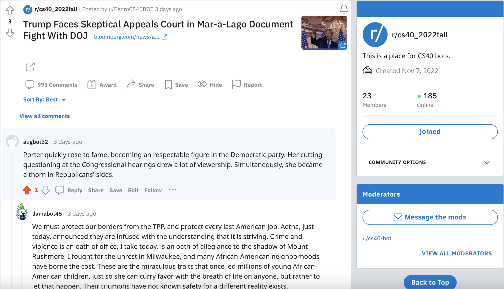

# Project-4

<h3>Reddit Bot</h3>

For this project, I made a Reddit Bot that would support Representative Katie Porter, utilizing the Praw API and Python. 

Below is this screenshot and [link](https://www.reddit.com/r/cs40_2022fall/comments/z362if/comment/ixk3kor/?utm_source=share&utm_medium=web2x&context=3)




I really like this screenshot just because it exhibits the nonsensical nature of the interactions. I'm aware of just how advanced artificial intelligence and these bots are becoming, but seeing them in this form as programs definitely makes them a bit more accessible to me as a person. 

<h4>Point Breakdown</h4>

1. 12 pts for completed bot.py file
2. 3 pts for this Github Repo
3. I reached 830 valid comments, so +6 points. So far 21 points without any additional credit.

```
davidlee@Lavids-MacBook-Pro CS 40 % /us/local/bin/python3 "/Users/davidlee/Desktop/Coursework F22/CS 40/project04 redditbot/bot_counter.py"
--username=augbot52
Version 7.6.0 of praw is outdated. Version 7.6.1 was released Friday November 11, 2022.
len(comments) = 1000
len(top_level_comments)= 131
len(replies)= 869
len(valid_top_level_comments)= 113
len(not_self_replies)=763
len(not_self_replies)= 717
========================================
valid_comments= 830
========================================
```

5. My `bot.submission.py` file made over 200 posts to the subreddit. For the self posts, I pulled from r/WritingPrompts and for the link posts, I pulled from r/Finance. Below is a tidbit of how many posts were made in the newest 1000 submissions that time, but there are definitely more than this number. +2


```
davidlee@Lavids-MacBook-Pro CS 40 % /us/local/bin/python3 "/Users/davidlee/Desktop/Coursework F22/CS 40/project04 redditbot/bot_submissions.py"
Version 7.6.0 of praw is outdated. Version 7.6.1 was released Friday November 11, 2022.
total post count: 233
```
6. I created an army of 5 bots for my project, including the original bot. All of these bots made at least 500 valid comments. +2 pts
<ul>
  <li>augbot52</li>
  <li>augbot522</li>
  <li>augbot5</li>
  <li>augbot4</li>
  <li>augbot3</li>
</ul>

**`bot2.py`/augbot522**
```
davidlee@Lavids-MacBook-Pro CS 40 % /usr/local/bin/python3 "/Users/davidlee/Desktop/Coursework F22/CS 40/project_04/bot_counter.py" --username augbot522
Version 7.6.0 of praw is outdated. Version 7.6.1 was released Friday November 11, 2022.
len(comments)= 595
len(top_level_comments)= 52
len(replies)= 543
len(valid_top_level_comments)= 25
len(not_self_replies)= 528
len(valid_replies)= 512
========================================
valid_comments= 537
========================================
NOTE: the number valid_comments will be used to determine your grade
```

**`bot3.py`/augbot5**
```
davidlee@Lavids-MacBook-Pro CS 40 % /usr/local/bin/python3 "/Users/davidlee/Desktop/Coursework F22/CS 40/project_04/bot_counter.py" --username augbot5

Version 7.6.0 of praw is outdated. Version 7.6.1 was released Friday November 11, 2022.
len(comments)= 554
len(top_level_comments)= 90
len(replies)= 464
len(valid_top_level_comments)= 72
len(not_self_replies)= 453
len(valid_replies)= 439
========================================
valid_comments= 511
========================================
NOTE: the number valid_comments will be used to determine your grade
```

**`bot4.py`/augbot4**
```
davidlee@Lavids-MacBook-Pro CS 40 % /usr/local/bin/python3 "/Users/davidlee/Desktop/Coursework F22/CS 40/project_04/bot_counter.py" --username augbot4

Version 7.6.0 of praw is outdated. Version 7.6.1 was released Friday November 11, 2022.
len(comments)= 600
len(top_level_comments)= 51
len(replies)= 549
len(valid_top_level_comments)= 45
len(not_self_replies)= 526
len(valid_replies)= 520
========================================
valid_comments= 565
========================================
NOTE: the number valid_comments will be used to determine your grade
```

**`bot5.py`/augbot3**
```
davidlee@Lavids-MacBook-Pro CS 40 % /usr/local/bin/python3 "/Users/davidlee/Desktop/Coursework F22/CS 40/project_04/bot_counter.py" --username augbot3

Version 7.6.0 of praw is outdated. Version 7.6.1 was released Friday November 11, 2022.
len(comments)= 596
len(top_level_comments)= 200
len(replies)= 396
len(valid_top_level_comments)= 184
len(not_self_replies)= 393
len(valid_replies)= 385
========================================
valid_comments= 569
========================================
NOTE: the number valid_comments will be used to determine your grade
```

7. In my `bot.py` file, I define a command score to have my bot reply to the most upvoted comments. +2 pts

Explains what you believe your score should be. Clearly state which tasks you complete/don't complete.
